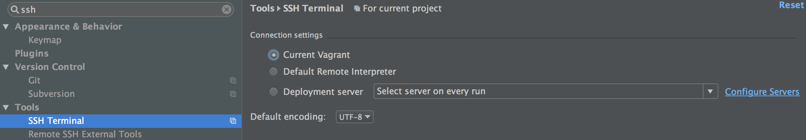

Tournamet App
=============
How To Use:

Use Case:

Build:
1. Get database up
2. Setting SSH Tunel from PyCharm into Vagrant Box Postgres
	1. https://www.evernote.com/shard/s6/sh/d4455cf4-7c76-44f0-8c62-ab16d3288ebb/ff30234a4cb1635b5e59df9be649e98c

TODOs:
1. Figure out how to Configure Data Sources & Drivers for Postgres Server so that PyCharm can provide advanced code assistance
	1. Investigated 

Project Targets:

Research:

TIPS:
to run a file locally:
vagrant@vagrant-ubuntu-trusty-32:~$ psql
psql (9.3.6)
Type "help" for help.

vagrant=> \i /vagrant/tournament/tournament.sql

Extra credit:

Don’t assume an even number of players. If there is an odd number of players, assign one player a “bye” (skipped round). A bye counts as a free win. A player should not receive more than one bye in a tournament.

Support games where a draw (tied game) is possible. This will require changing the arguments to reportMatch.
When two players have the same number of wins, rank them according to OMW (Opponent Match Wins), the total number of wins by players they have played against.

Support more than one tournament in the database, so matches do not have to be deleted between tournaments. This will require distinguishing between “a registered player” and “a player who has entered in tournament #123”, so it will require changes to the database schema.
